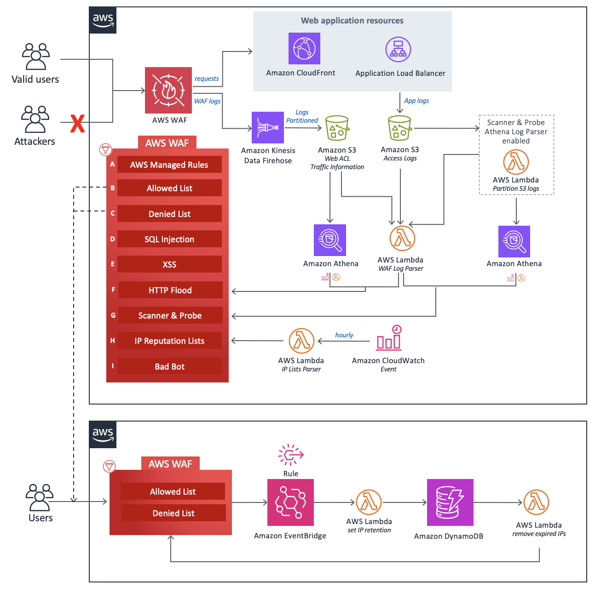

# 🛡️ AWS WAF Security Automations - Advanced Cloud Threat Protection

**"Automated web application firewall with intelligent threat detection and mitigation"**

[](#)
[](#)
[](#)
[](LICENSE.txt)

## 🎯 Overview

AWS WAF Security Automations is an **enterprise-grade security solution** that automatically deploys comprehensive web application firewall (WAF) rules to protect against sophisticated web-based attacks. This solution leverages AWS native services to provide intelligent, adaptive threat protection with minimal operational overhead.

Developed by AWS Solutions Architecture team, this automated security framework provides **real-time threat detection and mitigation** across multiple attack vectors, ensuring robust protection for CloudFront distributions and Application Load Balancers.

## 🏗️ **Architecture & Components**



### **🔒 Core Protection Layers**

#### **1. AWS Managed Rules (Foundation Layer)**
- **IP Reputation Rule Groups**: AWS-maintained threat intelligence feeds
- **Baseline Rule Groups**: Core OWASP protection against common vulnerabilities
- **Use-Case Specific Rules**: Targeted protection for specific application types
- **Automatic Updates**: AWS-managed rule updates without manual intervention

#### **2. Manual IP Management**
- **Allow Lists**: Whitelist trusted IP addresses and ranges
- **Deny Lists**: Block known malicious IP addresses
- **IP Retention Management**: Automatic cleanup of expired IP entries
- **Dynamic Updates**: Real-time IP list management via API calls

#### **3. Application Security Protection**
- **SQL Injection Defense**: Advanced pattern matching for SQL injection attempts
- **Cross-Site Scripting (XSS) Protection**: Comprehensive XSS attack prevention
- **Request Validation**: URI, query string, and body content inspection
- **Custom Pattern Matching**: Configurable threat signature detection

#### **4. Rate Limiting & DDoS Mitigation**
- **HTTP Flood Protection**: Intelligent rate limiting based on request patterns
- **Burst Detection**: Sudden traffic spike identification and mitigation
- **Distributed Attack Response**: Coordinated defense against DDoS attacks
- **Adaptive Thresholds**: Machine learning-based rate limit adjustments

#### **5. Scanner & Probe Detection**
- **Log Analysis**: Real-time application access log monitoring
- **Anomaly Detection**: Behavioral analysis for suspicious activity patterns
- **Error Rate Monitoring**: Abnormal error generation pattern detection
- **Automated Response**: Dynamic IP blocking for detected threats

#### **6. Threat Intelligence Integration**
- **Third-Party IP Reputation**: Integration with Spamhaus, Proofpoint, Tor lists
- **Hourly Updates**: Automated threat intelligence feed refreshing
- **Multi-Source Aggregation**: Combined threat intelligence from multiple providers
- **Custom Feed Support**: Integration capability for proprietary threat feeds

#### **7. Advanced Bot Detection**
- **Honeypot Mechanisms**: Sophisticated bot trap deployment
- **Behavioral Analysis**: Advanced bot behavior pattern recognition
- **Direct Connection Monitoring**: ALB/CloudFront bypass attempt detection
- **Multi-Layer Detection**: Comprehensive bot identification across multiple vectors

## 🚀 **Deployment & Implementation**

### **Prerequisites**
- **AWS Account** with appropriate IAM permissions
- **AWS CLI** configured with deployment credentials
- **CloudFormation** or **CDK** for infrastructure deployment
- **Target Resources**: CloudFront distribution or Application Load Balancer

### **Quick Deployment**
```bash
# Deploy via AWS CloudFormation
aws cloudformation deploy \
  --template-file aws-waf-security-automations.template \
  --stack-name my-waf-security-automations \
  --parameter-overrides \
    ProtectedResourceName=my-application \
    ActivateSqlInjectionProtection=yes \
    ActivateCrossSiteScriptingProtection=yes

# Monitor deployment
aws cloudformation describe-stacks \
  --stack-name my-waf-security-automations
```

### **CDK Deployment**
```bash
# Navigate to infrastructure directory
cd source/infrastructure/

# Install dependencies and deploy
npm install
cdk bootstrap
cdk deploy AWS-WAF-Security-Automations
```

## 🔧 **Advanced Configuration**

### **Protection Customization**
| Component | Configuration Options | Use Cases |
|-----------|----------------------|-----------|
| **SQL Injection Protection** | Custom patterns, sensitivity levels | Database-driven applications |
| **XSS Protection** | Content filtering, script validation | Dynamic web applications |
| **Rate Limiting** | Request thresholds, time windows | API protection, DDoS mitigation |
| **Bot Detection** | Behavioral patterns, challenge mechanisms | E-commerce, content protection |
| **IP Reputation** | Source feeds, update frequency | Global threat protection |

### **Integration Points**
- **Amazon CloudWatch**: Comprehensive security metrics and alerting
- **AWS Lambda**: Custom security logic and automated responses
- **Amazon S3**: Log storage and analysis capabilities
- **Amazon Athena**: Advanced log querying and threat hunting
- **Amazon SNS**: Real-time security notifications and alerts

## 📊 **Use Cases & Applications**

### **Enterprise Web Applications**
- **E-commerce Platforms**: Payment processing protection and fraud prevention
- **SaaS Applications**: Multi-tenant security and data protection
- **Content Management**: Publishing platform security and content integrity
- **API Gateways**: RESTful API protection and rate limiting

### **Compliance & Governance**
- **PCI DSS Compliance**: Payment card industry security requirements
- **GDPR Data Protection**: European data privacy regulation compliance
- **SOC 2 Controls**: Security operations and monitoring requirements
- **Industry Standards**: Sector-specific security compliance frameworks

### **DevSecOps Integration**
- **CI/CD Pipeline Security**: Automated security testing and validation
- **Infrastructure as Code**: Security rule management and version control
- **Monitoring & Alerting**: Real-time security event detection and response
- **Incident Response**: Automated threat containment and mitigation

## 🔍 **Security Monitoring & Analytics**

### **Real-Time Dashboards**
- **Attack Vector Analysis**: Visual representation of threat patterns
- **Traffic Pattern Monitoring**: Normal vs. anomalous behavior identification
- **Performance Metrics**: Security rule effectiveness measurements
- **Geographic Threat Mapping**: Global attack source visualization

### **Advanced Analytics**
- **Threat Hunting**: Proactive security investigation capabilities
- **Behavioral Baselines**: Normal application behavior establishment
- **Predictive Analytics**: Future threat pattern identification
- **Custom Queries**: Flexible log analysis and reporting

## ⚡ **Performance & Scalability**

### **High Availability**
- **Multi-Region Deployment**: Global threat protection coverage
- **Auto-Scaling**: Dynamic capacity adjustment based on traffic
- **Fault Tolerance**: Redundant security component architecture
- **Load Distribution**: Efficient request processing across multiple zones

### **Cost Optimization**
- **Intelligent Caching**: Reduced processing overhead through smart caching
- **Conditional Rules**: Selective protection based on traffic characteristics
- **Resource Optimization**: Efficient AWS service utilization
- **Pay-Per-Use**: Cost-effective pricing based on actual usage

## 🎯 **Professional Applications**

This AWS WAF Security Automations solution demonstrates expertise in:
- **Cloud Security Architecture** and automated threat protection
- **Infrastructure as Code** deployment and management
- **Enterprise Security Operations** and monitoring
- **DevSecOps Integration** and security automation
- **Compliance Management** and regulatory requirements

---

## 📞 **Professional Contact**

**Tope Adekeye**  
🔗 **LinkedIn**: [linkedin.com/in/tope-adekeye](https://linkedin.com/in/tope-adekeye)  
💼 **GitHub**: [github.com/Tope-Adekeye](https://github.com/Tope-Adekeye)  
📧 **Email**: [adekeyetopeaiexpert@gmail.com](mailto:adekeyetopeaiexpert@gmail.com)

*Cloud Security Professional specializing in AWS Security Architecture, Threat Protection, and Security Automation*

---

## 🏆 **Solution Components**

**Core Technologies**: AWS WAF • CloudFormation • CDK • Lambda • CloudWatch • Athena • S3 • SNS  
**Security Features**: OWASP Protection • DDoS Mitigation • Bot Detection • Threat Intelligence • Rate Limiting  
**Integration**: API Gateway • CloudFront • Application Load Balancer • DevSecOps Pipelines
