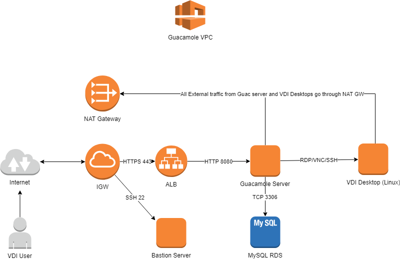

# 🖥️ Apache Guacamole AWS Bastion - Secure Remote Access Gateway

**"Clientless remote desktop gateway with zero-trust security architecture on AWS"**

[](#)
[](#)
[](#)
[](LICENSE)

## 🎯 Overview

This enterprise-grade **Apache Guacamole deployment** provides a secure, clientless remote desktop gateway on AWS infrastructure. Built with Terraform Infrastructure as Code, this solution enables secure access to internal resources through a web browser without requiring client software or VPN connections.

Apache Guacamole serves as a **zero-trust bastion host** that centralizes remote access control, providing HTML5-based connections to RDP, SSH, and VNC protocols with comprehensive audit logging and session management.

## 🏗️ **Architecture & Infrastructure**



### **🔒 Security Architecture**
- **Zero-Trust Gateway**: Centralized access control with no client software requirements
- **Multi-Protocol Support**: Secure RDP, SSH, and VNC connections through web interface
- **Session Management**: Comprehensive logging and audit trail for all remote sessions
- **Network Isolation**: Private subnet deployment with controlled egress through NAT gateways

### **☁️ AWS Infrastructure Components**

#### **Networking Layer**
- **1 VPC**: Dedicated virtual private cloud with custom CIDR
- **6 Subnets**: 2 public, 2 private, 2 VDI subnets across availability zones
- **2 NAT Gateways**: High-availability outbound internet access for private subnets
- **Internet Gateway**: Controlled ingress for public-facing components
- **Security Groups**: Granular network access control and micro-segmentation

## 🚀 **Deployment & Configuration**

### **Prerequisites**
- **AWS Account** with appropriate IAM permissions
- **Terraform** v0.12+ installed and configured
- **SSL Certificate** uploaded to AWS Certificate Manager or IAM
- **EC2 Key Pair** for bastion and Guacamole server access

### **Quick Deployment**
```bash
# Configure deployment variables
cp terraform.tfvars.sample terraform.tfvars
vim terraform.tfvars  # Update with your AWS settings

# Deploy infrastructure
terraform init
terraform plan
terraform apply
```

## 📞 **Professional Contact**

**Tope Adekeye**  
🔗 **LinkedIn**: [linkedin.com/in/tope-adekeye](https://linkedin.com/in/tope-adekeye)  
💼 **GitHub**: [github.com/Tope-Adekeye](https://github.com/Tope-Adekeye)  
📧 **Email**: [adekeyetopeaiexpert@gmail.com](mailto:adekeyetopeaiexpert@gmail.com)

*Cloud Security Professional specializing in Zero-Trust Architecture, AWS Security, and Secure Remote Access Solutions*
